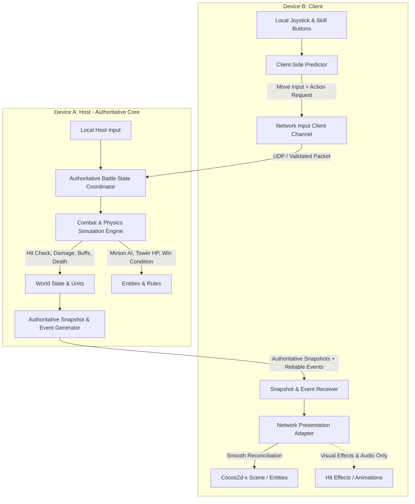
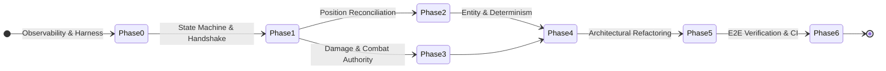
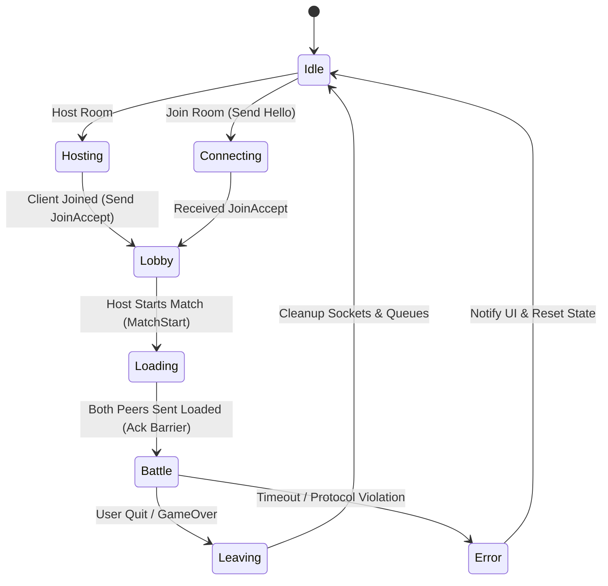
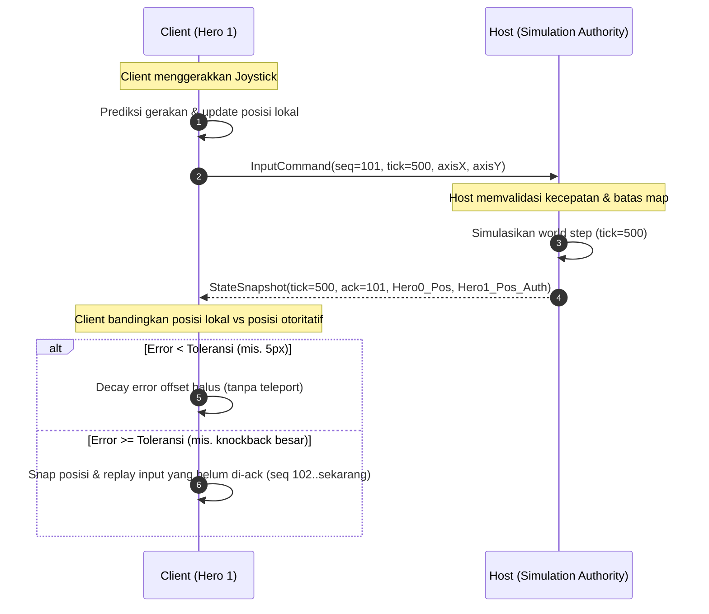
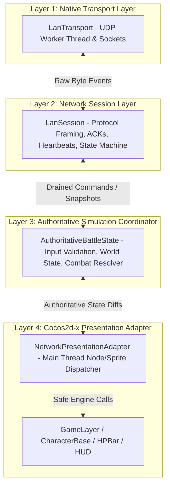

# Rencana Final — Upgrade Arsitektur Multiplayer LAN NarutoSenki-V2 (Host-Authoritative)

**Repo (asumsi dari dokumen sumber):** `sansaks-jpg/NarutoSenki-V2`
**Branch target:** `feature/lan-hotspot-multiplayer`
**Status:** Draft final gabungan — siap direview sebelum eksekusi

---

## 0. Tentang Dokumen Ini

Dokumen ini adalah **penggabungan** dua rencana yang dihasilkan oleh dua agent berbeda:

- **Dok-1** — `Rencana_Upgrade_Arsitektur_Multiplayer_NarutoSenki.md` (ringkas, 5 fase, fokus pada aturan main dan file yang disentuh).
- **Dok-2** — `multiplayer_architecture_upgrade_plan.md` (detail, 7 fase, dilengkapi diagram, formula rekonsiliasi, matrix kriteria lulus, dan skrip verifikasi).

Kedua dokumen **sepakat pada arah arsitektur** (host-authoritative penuh) dan saling melengkapi, tapi ada beberapa titik yang **tidak konsisten** satu sama lain — biasanya karena masing-masing agent menebak struktur folder/file tanpa akses penuh ke repo, atau menaruh penekanan berbeda. Alih-alih menyembunyikan itu, saya tandai eksplisit setiap konflik di bagian yang relevan (dicari dengan label **⚠️ REKONSILIASI**) supaya Anda atau tim dev bisa memutuskan/verifikasi sebelum eksekusi, bukan menemukan konfliknya di tengah coding.

Tiga konflik terbesar yang perlu perhatian Anda duluan:

1. **Struktur file kombat/spawn tidak sama.** Dok-1 mengasumsikan file `CommandSystem.hpp/cpp` (di `Classes/Systems/`) dan `SpawnSystem.cpp` sebagai titik ubah utama. Dok-2 sama sekali tidak menyebut kedua file itu dan malah mengusulkan dua kelas baru: `AuthoritativeBattleState` dan `NetworkPresentationAdapter`. → Lihat §5, baris bertanda VERIFY.
2. **Status test suite bertentangan.** Dok-1 menyatakan eksplisit *"belum ada test suite unit/integrasi formal pada repositori ini"*. Dok-2 menandai `tests/lan_protocol_test.cpp` dan `tests/lan_session_test.cpp` sebagai **[MODIFY]** (artinya harus sudah ada). Ini tidak bisa keduanya benar. → Lihat §7.
3. **Lokasi `CharacterBase`** disebut `Classes/Core/CharacterBase.*` di Dok-1, tapi `Classes/CharacterBase.cpp` (tanpa folder `Core`) di Dok-2. → Lihat §5.

Selain itu, dokumen ini menambahkan **satu poin teknis baru** yang tidak ada di kedua rencana asli: potensi *tunneling* pada proyektil cepat akibat tick rate 30 Hz (§4, Fase 4), untuk menjawab tuntas pertanyaan terbuka soal peluru cepat di Dok-1.

---

## 1. Ringkasan Masalah & Tujuan

### Empat kategori bug yang Anda laporkan (dan akar penyebab paling mungkin)

| # | Gejala yang dilaporkan | Akar penyebab (berdasarkan kedua rencana) |
|---|---|---|
| 1 | **Posisi pemain tidak sinkron** | Client dan Host sama-sama mensimulasikan gerakan secara independen tanpa rekonsiliasi dinamis → posisi client meleset, "meluncur" saat paket stop hilang, atau teleport kasar saat dikoreksi. |
| 2 | **Damage tidak konsisten** | Client dan Host sama-sama mengeksekusi logika hit lokal (side effect ganda), status hurt/dead terlambat sync, sehingga HP dan hitungan kill/death berbeda di dua layar. |
| 3 | **Minion tidak konsisten** | Client masih menjalankan AI/spawn lokal sendiri; race condition saat spawn/destroy; RNG tidak deterministik antara Host dan Client. |
| 4 | **Tidak ada komunikasi Host↔Join** | State machine sesi tidak tegas (tidak idempotent), tidak ada heartbeat/timeout yang jelas, packet drop saat handshake tidak direcover otomatis → sesi menggantung/stuck. |

### Tujuan akhir arsitektur baru

- **Host-Authoritative mutlak**: seluruh hasil kalkulasi tempur (hit resolution, damage, cooldown, chakra, knockback/stun, spawn/despawn, kondisi menang) dieksekusi **hanya oleh Host**. Client tidak pernah menyimpulkan hasil sendiri.
- **Client-side prediction + reconciliation halus**: Client tetap memprediksi gerakan hero miliknya sendiri agar terasa responsif, lalu dikoreksi ke posisi otoritatif Host lewat *error-decay*, bukan snap/teleport kasar.
- **3 kanal komunikasi terpisah**:
  1. *Control Plane* — handshake, room/lobby, ready, match config, loading barrier, resync, disconnect.
  2. *Gameplay Input Channel* — input gerakan (rate-limited) + aksi diskrit reliable (attack, skill, item).
  3. *Authoritative State/Event Channel* — snapshot dunia (15–20 Hz) + event kombat otoritatif (hit, hurt, death, spawn, tower damage, match end).
- **Zero impact ke mode Offline**: mode Offline/Training tidak boleh membuka socket atau melakukan polling jaringan sama sekali.



---

## 2. Catatan Kritis untuk Direview Sebelum Implementasi

> [!CAUTION]
> **Trade-off lag Host.** Karena arsitektur ini host-authoritative, kalau Host mengalami lag, pergerakan karakter lawan (bukan milik Host) di layar Client ikut tersendat. Ini trade-off yang disengaja demi menjamin HP dan posisi akhir selalu sinkron — bukan bug baru.

> [!WARNING]
> **`GameLayer` dan `CharacterBase` berubah cara memproses hit/damage.** Client dilarang keras memicu perubahan HP musuh secara mandiri. Semua side-effect (animasi hit, efek proyektil, suara) harus bisa berjalan **tanpa** langsung mengubah `hp` di memori kalau perannya Client. Secara konkret, di Client: `CharacterBase::acceptAttack`, `CharacterBase::setDamage`, `HPBar::loseHP`, dan perhitungan cooldown skill menjadi **no-op untuk state logis** — animasi tetap main untuk responsivitas visual, tapi angka damage/chakra/knockback hanya berlaku setelah dikonfirmasi Host.

> [!IMPORTANT]
> **Pemisahan jalur simulasi vs presentasi.** Kode di `CharacterBase.cpp` / `Hero.hpp` tidak boleh memodifikasi HP, cooldown, atau status unit di Client secara mandiri saat tombol ditekan. Semua outcome pertempuran di Client diterapkan eksklusif lewat adapter presentasi (`NetworkPresentationAdapter` / adapter `applyAuthoritativeHealth` dkk — lihat §4 Fase 3).

> [!WARNING]
> **Kenaikan versi protokol (Protocol v3) = breaking change.** Header paket akan menambah field baru (`sessionEpoch`, `clientSequenceWatermark`, `combatEventId`, `stateChecksum`) untuk mencegah race condition dan dedup event. Ini **memutus backward compatibility** dengan build lama — kedua device wajib memakai versi APK yang sama saat testing maupun rilis. Ini poin operasional, bukan cuma kode: kalau tim QA/tester tidak update APK bareng, mereka akan salah menyimpulkan "masih desync" padahal sebenarnya beda versi protokol.

---

## 3. Kenapa Urutan Fase Ini yang Dipilih (rasional prioritas)

Sebelum masuk ke detail fase, ini logika di balik urutannya — supaya tim tidak mengerjakan semuanya paralel tanpa arah:

1. **Fase 0 dan 1 harus selesai & tervalidasi duluan**, karena keluhan Anda soal *"tidak ada komunikasi antar host dan join"* adalah masalah fondasi. Kalau lapisan komunikasi belum stabil, setiap upaya memperbaiki posisi/damage akan sulit dievaluasi — Anda tidak bisa membedakan "ini bug posisi" dari "ini sebenarnya paket yang drop/telat karena handshake belum kuat". Ini classic *confounding variable*: memperbaiki lapisan atas di atas fondasi yang goyang cuma menambah noise ke observasi.
2. **Fase 2 (posisi) dan Fase 3 (damage) relatif independen** satu sama lain — gerakan vs kombat — jadi bisa dikerjakan paralel oleh dua orang/dua PR berbeda, **asal** tooling diagnostics dari Fase 0 (checksum, sequence tracking) sudah ada duluan untuk memverifikasi keduanya.
3. **Fase 4 (entity: minion/tower/guardian/proyektil) baru bisa jalan penuh setelah Fase 3**, karena damage minion-ke-tower memakai jalur `CombatEvent`/otoritas HP yang sama dengan Fase 3. Mengerjakan Fase 4 sebelum Fase 3 selesai berarti membangun di atas pipa yang belum solid.
5. **Fase 5 (refactor 4-layer clean architecture) sengaja diletakkan setelah bug-fix fungsional (Fase 0–4), bukan bareng.** Refactor struktural besar + bug fix fungsional dalam PR yang sama = kalau muncul regresi baru, sulit di-bisect penyebabnya apakah dari refactor atau dari perubahan logika. Ini prinsip standar risk management di software engineering: jangan gabung "ubah struktur" dengan "ubah perilaku" dalam commit yang sama.
6. **Fase 6 (verifikasi E2E) bukan benar-benar "paling akhir" dalam praktik** — harness otomatis (reproduction harness Fase 0 + `deterministic_battle_test.cpp`) sebaiknya ditulis incremental berbarengan dengan Fase 1–4, dengan satu putaran stress-test penuh di akhir sebagai gerbang rilis.



---

## 4. Rencana Bertahap (Fase 0–6)

### Fase 0 — Observability & Reproduction Harness

**Tujuan:** Bangun visibilitas terhadap metrik network dan state simulasi *sebelum* mengubah alur battle, supaya semua fase berikutnya punya cara objektif untuk membuktikan "sudah sinkron" atau "belum".

**Rincian teknis:**
- **Packet/Session Diagnostics** — struct `SessionDiagnostics` pada `LanSession`, isinya minimal: `connectionId`, `matchId`, `role`, `peerEndpoint`, `currentFsmState`, `lastReceiveMs`/`lastSendMs`, `lastAppliedTick`, `lastInputSequence`, `ackWatermark`, `pendingQueueDepth`, `resendCount`, `droppedPacketCount`, `duplicatePacketCount`, `outOfOrderCount`, `disconnectReason`. Logging non-blocking, frekuensi rendah (1 Hz) atau on-event, dibungkus `#if NSV2_NETWORK_DEBUG` supaya tidak membebani build rilis.
- **State Checksum** — hash ringan (CRC32/FNV-1a 32-bit) atas state penting per 30 tick, kira-kira: `Checksum = hash(Tick, Hero0.HP, Hero0.Pos, Hero1.HP, Hero1.Pos, TowerHPs, MinionCount)`. Dikirim di metadata `StateSnapshot` sehingga desync bisa terdeteksi instan saat testing, bukan cuma "kelihatan aneh secara visual".
- **Reproducible Harness (seed PRNG sinkron)** — suntikkan seed PRNG yang sama di Host dan Client saat inisiasi `MatchConfig`, jadi bug bisa direproduksi ulang dengan input sequence yang identik (detail RNG deterministik selengkapnya ada di Fase 4).
- **Skenario harness headless** yang perlu dibuat:
  1. *Continuous Walk & Release* — pastikan tidak ada gerak "meluncur abadi" saat paket stop di-drop.
  2. *Skill Burst & Cooldown* — pastikan spam skill tidak memicu cooldown out-of-sync.
  3. *Minion Wave & Tower Siege* — 180 tick gelombang minion & damage tower harus identik di kedua sisi.
  4. *Disconnect & Timeout* — pastikan state cleanup rapi saat peer putus mendadak.

---

### Fase 1 — Perkuat Lifecycle & Komunikasi Host↔Join

**Tujuan:** Membuat alur koneksi kebal terhadap packet drop, stale endpoint, race condition saat loading, dan timeout yang menggantung. Ini fase yang **langsung menjawab keluhan "tidak ada komunikasi antar host dan join"**.



**Rincian teknis:**
- **State machine eksplisit & idempotent** — tegakkan transisi ketat `Idle → Hosting/Connecting → Lobby → Loading → Battle → Leaving/Finished/Error`, tiap transisi punya fungsi entry/exit cleanup yang aman dipanggil berulang.
- **Handshake token & capability flags** — paket `Hello`/`JoinAccept` membawa `protocolVersion = 3`, `connectionNonce`, `capabilityFlags`. Paket asing yang tidak cocok endpoint (`_remoteAddress:_remotePort`) atau `matchId` langsung dibuang di level `LanTransport`.
- **Heartbeat & fail-fast timeout** — nilai default yang direkomendasikan (dua rencana sumber cocok satu sama lain di sini — Dok-1 bilang rentang umum "5–10 detik", Dok-2 kasih angka spesifik yang jatuh persis di rentang itu, jadi ini validasi silang yang bagus):
  - Heartbeat interval: **1000 ms**
  - Connecting/handshake timeout: **5000 ms** (retransmit `Hello` tiap 500 ms)
  - Lobby idle timeout: **10000 ms**
  - Battle stall timeout: **6000 ms**
  - Jika timeout terlampaui → koneksi diputus ke `Error`/`Leave`, thread UDP dihentikan, UI kembali ke `StartMenu`.
- **Idempotent resource cleanup** — tutup worker thread socket, kosongkan queue (`_pendingReliable`, `_inputCommands`, `_snapshots`), reset `MatchConfig` tanpa dangling pointer.

---

### Fase 2 — Perbaiki Sinkronisasi Posisi (Prediction & Reconciliation)

**Tujuan:** Hilangkan bug "karakter meluncur terus", teleport kasar, dan drift koordinat. Ini yang **langsung menjawab keluhan "posisi pemain tidak sinkron"**.



**Rincian teknis:**
- **Sequenced input commands** — Client tidak lagi kirim posisi absolut mentah. Client kirim `InputCommand` berkala (30 Hz, rate-limited) berisi `tick`, `sequence`, `axisX`, `axisY`, `action`. Perubahan arah dan **joystick release (stop move)** diberi flag `isDiscreteAction = true` sehingga otomatis masuk reliable-retransmission queue sampai di-ack Host — ini yang menutup bug "infinite walk" karena paket release hilang.
- **Host input validation & physics** — Host simpan sliding window input terakhir per slot, validasi terhadap collision map, kecepatan maksimal (`CharacterBase::getSpeed()`). Watchdog idle: kalau tidak ada input baru dalam `Δt > 200 ms`, kecepatan hero lawan di-zero secara aman di simulasi Host.
- **Client prediction & error-decay reconciliation** — Client simpan ring-buffer input lokal yang belum di-ack. Saat `StateSnapshot` tiba: hitung `E = pos_predicted - pos_auth`. Jika `|E| < snapThreshold` (mis. 32px), terapkan `E_render = E * e^(-λt)` pada render tanpa teleport instan. Jika `|E| >= snapThreshold` (mis. kena knockback besar), snap posisi dan replay input dari sequence berikutnya.
- **Interpolasi entity lawan** — hero lawan dan unit lain (minion, guardian) diinterpolasi mulus dari buffer snapshot Host dengan delay render tetap ~60–100 ms, **tanpa** menjalankan `doAI()` atau prediksi lokal sendiri (supaya tidak ada risiko asinkron baru). Kalau state berubah jadi `HURT`/`KNOCKDOWN`/`DEAD`, ekstrapolasi langsung dibatalkan.

---

### Fase 3 — Satukan Otoritas Damage & Combat Outcome

**Tujuan:** Musnahkan HP berbeda, status knockback tidak sama, dan kill/death counter desync. Ini yang **langsung menjawab keluhan "damage tidak sama"**.

**Rincian teknis:**
- **Eliminasi mutasi tempur mandiri di Client** — `CharacterBase::acceptAttack`, `CharacterBase::setDamage`, `HPBar::loseHP`, dan hitungan cooldown skill jadi no-op untuk state logis di Client. Animasi tetap main untuk responsivitas, tapi damage/chakra/knockback numerik hanya berlaku setelah dikonfirmasi Host.
- **Adapter presentasi otoritatif** — interface khusus yang dipanggil Client saat menerima event dari Host:
  - `applyAuthoritativeHealth(slot, hp, maxHp, triggerHurtFx)`
  - `applyAuthoritativeCombatState(slot, newState, knockbackVelocity)`
  - `applyAuthoritativeDeath(slot, deadNum, rebornTime)`
  - `applyAuthoritativeChakra(slot, ckr)`
- **Event kombat diskrit & reliable** — tambah stream event di dalam protokol snapshot:

```cpp
enum class CombatEventType : uint8_t {
    AttackConfirmed = 1,
    HitImpact = 2,
    KnockbackApplied = 3,
    CharacterDead = 4,
    CharacterReborn = 5,
    SkillCooldownTriggered = 6
};

struct CombatEvent {
    uint32_t eventId = 0;
    uint32_t tick = 0;
    uint8_t  eventType = 0; // CombatEventType
    uint8_t  sourceSlot = 0;
    uint8_t  targetSlot = 0;
    int32_t  value = 0;     // damage amount atau status param
    int16_t  posX = 0;
    int16_t  posY = 0;
};
```

  Tiap event punya `eventId` unik + `tick`; Client memproses secara **dedup** (menghindari efek suara/partikel dobel kalau paket sama diterima dua kali) untuk memicu efek audio, partikel, dan animasi hurt/knockdown tepat waktu.

---

### Fase 4 — Entitas Authoritative (Minion, Tower, Guardian, Proyektil, RNG)

**Tujuan:** Jamin kesamaan total pada seluruh elemen dunia pertempuran dan hasil kemenangan. Ini yang **langsung menjawab keluhan "minion tidak konsisten"**.

**Rincian teknis:**
- **Host-only world simulation:**
  - *Minion (Flog)* — hanya Host yang jalankan `addFlog`, kalkulasi waypoint, `doAI()` targeting, dan damage ke tower. Client cuma render visual berdasarkan `UnitSnapshot` dari Host. `SpawnSystem` di Client dimatikan total untuk mode multiplayer LAN.
  - *Tower* — HP, visual kerusakan, dan deteksi hancur 100% diatur Host. Trigger `onGameOver` di Client hanya dipicu pesan otoritatif `MessageType::MatchEnd`.
  - *Guardian* — trigger spawn (mis. saat center tower ≤ 80% HP) dihitung Host saja; Client mereplikasi sprite berdasarkan ID unit.
  - *Setiap unit (Flog/Tower/Summon) punya `UnitID` deterministik global* yang dikirim oleh Host, supaya identitas entity tidak pernah ambigu antara kedua sisi.
- **RNG deterministik** — hapus semua `srand(time(0))`/`rand()` di jalur pertempuran multiplayer, ganti dengan RNG deterministik (Xoroshiro128+ atau Xorshift32) yang di-seed dari `MatchConfig.seed`. Semua keputusan acak (crit rate, nama guardian, variasi flog) menghasilkan nilai identik di tick yang sama pada kedua sisi.

> [!NOTE]
> **Tambahan teknis (belum dibahas di kedua rencana sumber): risiko *tunneling* pada proyektil cepat.**
> Ini jawaban konkret untuk pertanyaan terbuka soal peluru cepat. Pada tick rate 30 Hz (~33.3 ms per tick), proyektil yang bergerak cukup cepat bisa "melompati" hitbox target dalam satu tick jika hit-detection hanya mengecek posisi titik di akhir tick (point-check). Hasilnya: peluru terlihat menembus tanpa registrasi hit.
> **Rekomendasi:** untuk `Bullet`/`Projectile` secara khusus, Host sebaiknya memakai pengecekan collision *swept/segment* (garis dari posisi tick sebelumnya ke posisi tick sekarang diuji terhadap AABB target), bukan cuma cek titik di posisi akhir. Ini tetap konsisten dengan rencana "Host memvalidasi trajectory proyektil, Client cuma render visual" — hanya menambah presisi *bagaimana* validasi itu dilakukan.

---

### Fase 5 — Refactor Boundary Kode & Protocol (Clean Architecture)

**Tujuan:** Pisahkan dependensi socket, state logic, dan rendering Cocos2d-x ke 4 layer yang terisolasi dan mudah diuji. **Dikerjakan setelah Fase 0–4 stabil** (lihat rasional di §3, poin 5).



- **Layer 1** (`LanTransport.hpp/.cpp`) — socket UDP murni, worker thread background, mutex-guarded event queue. Tidak boleh ada `#include` Cocos2d-x sama sekali.
- **Layer 2** (`LanSession.hpp/.cpp`, `LanProtocol.hpp/.cpp`) — framing protokol v3, cumulative piggybacked ACK, sliding window sequence validation, queue backpressure limit (maks 128 paket).
- **Layer 3** (`AuthoritativeBattleState.hpp/.cpp` — NEW) — validasi input pemain, simpan snapshot dunia independen, eksekusi aturan kombat di Host.
- **Layer 4** (`NetworkPresentationAdapter.hpp/.cpp` — NEW) — jalan eksklusif di main thread lewat `GameLayer::updateNetworkBattle()`, menerjemahkan snapshot jadi panggilan visual ke sprite/node Cocos2d-x.

---

### Fase 6 — Verifikasi End-to-End & Stress Testing

Detail lengkap di §7. Fase ini memastikan semua kriteria di §6 lulus lewat kombinasi test otomatis, harness loopback simulasi packet-loss, dan smoke test 2-device.

---

## 5. Perubahan File yang Diusulkan (final, dengan status rekonsiliasi)

| File | Status | Perubahan | Catatan rekonsiliasi |
|---|---|---|---|
| `Classes/Network/LanSession.hpp` / `.cpp` | MODIFY | Diagnostics struct, FSM ketat + idempotent cleanup, heartbeat/timeout policy, retransmisi diskrit dengan backpressure, validasi source IP + matchId | Kedua rencana sepakat. |
| `Classes/Network/LanTransport.hpp` / `.cpp` | MODIFY | Validasi ketat payload, buang paket asing/port salah, reliable-UDP wrapper/queue bila perlu | Kedua rencana sepakat. |
| `Classes/Network/LanProtocol.hpp` / `.cpp` | MODIFY | Naikkan `kProtocolVersion = 3`, tambah `CombatEvent`, `sessionEpoch`, `clientSequenceWatermark`, `combatEventId`, `stateChecksum` di `StateSnapshot`, sanitasi boundary payload | Breaking change wire format — wajib koordinasi versi APK di kedua device (lihat §2). |
| `Classes/Network/AuthoritativeBattleState.hpp` / `.cpp` | NEW | Layer 3: koordinator simulasi otoritatif Host (validasi input, physics, resolusi kombat, RNG deterministik) | ⚠️ Hanya diusulkan Dok-2. Secara fungsi ini menyerap sebagian besar peran yang di Dok-1 dititipkan ke `CommandSystem`. |
| `Classes/Network/NetworkPresentationAdapter.hpp` / `.cpp` | NEW | Layer 4: adapter snapshot → visual di Client (reconciliation, trigger animasi, update HPBar) | Hanya diusulkan Dok-2. |
| `Classes/Systems/CommandSystem.hpp` / `.cpp` | MODIFY — **VERIFY** | Kalau file ini memang ada: tambah `applyAuthoritativeState` sebagai titik masuk Client yang menerima state dari `AuthoritativeBattleState`/`NetworkPresentationAdapter` dan blokir eksekusi hit lokal | ⚠️ Hanya disebut Dok-1. **Cek dulu apakah `CommandSystem` benar-benar ada di repo.** Kalau tidak ada, perannya sudah tercakup oleh `AuthoritativeBattleState` + `NetworkPresentationAdapter` dan langkah ini bisa dilewati. |
| `CharacterBase.hpp` / `.cpp` | MODIFY — **VERIFY PATH** | Isolasi kalkulasi damage lokal saat mode Client LAN; animasi hit tetap jalan, HP tidak diubah langsung | ⚠️ Dok-1 menyebut path `Classes/Core/CharacterBase.*`, Dok-2 menyebut `Classes/CharacterBase.cpp` (tanpa folder `Core`). **Konfirmasi path asli** (`find . -name "CharacterBase.*"`) sebelum edit. |
| `Classes/Core/Hero.hpp` | MODIFY | Larang modifikasi HP/cooldown/status secara mandiri di Client saat tombol ditekan | Hanya disebut Dok-2, tapi konsisten dengan prinsip Fase 3. |
| `Classes/HPBar.cpp` | MODIFY | `loseHP()` tidak boleh memicu trigger gameplay ganda; dipisah dari logika pengurangan HP aktual (kini di Host) | Kedua rencana sepakat. |
| `Classes/GameLayer.h` / `.cpp` | MODIFY | Tambah pointer ke `NetworkPresentationAdapter` & `AuthoritativeBattleState`; sederhanakan `updateNetworkBattle`; hubungkan input joystick/skill ke sequenced input queue; hapus manipulasi manual `_netCharLerp` ad-hoc | Hanya disebut Dok-2. |
| `SpawnSystem.cpp` (atau logic setara) | MODIFY — **VERIFY EXISTENSI** | Matikan AI & auto-spawn minion di Client; spawn murni dari `UnitSnapshot` Host | ⚠️ Dok-1 menyebutnya file terpisah ("atau sejenisnya" — sudah tidak yakin sendiri). Dok-2 tidak menyebutnya sama sekali dan mengasumsikan logic ini melebur ke `GameLayer`/`AuthoritativeBattleState`. **Cari dulu** apakah file ini ada sebelum menugaskan siapa pun untuk mengeditnya. |
| `tests/lan_protocol_test.cpp` | **MODIFY/NEW — VERIFY** | Test serialisasi `CombatEvent`, frame protocol v3, penolakan buffer korup, oversized frame | ⚠️ Lihat kontradiksi di §7 — status riil bergantung apakah file ini sudah ada. |
| `tests/lan_session_test.cpp` | **MODIFY/NEW — VERIFY** | Simulasi loopback + packet-loss generator (1%/5%/15%), reordering simulator, validasi rekonsiliasi posisi | Sama seperti di atas. |
| `tests/deterministic_battle_test.cpp` | NEW | Test determinisme: input sequence sama → checksum CRC32 identik di Host | Disepakati sebagai file baru oleh Dok-2; sejalan dengan kebutuhan harness di Fase 0. |

---

## 6. Kriteria Penerimaan (dipetakan ke keluhan Anda)

| Area | Memetakan ke keluhan # | Kriteria lulus |
|---|---|---|
| **Lifecycle & Komunikasi** | #4 (komunikasi host-join) | Host dan Client tidak pernah soft-lock/hanging; kalau salah satu device disconnect/timeout, kedua UI kembali ke state valid secara bersih. |
| **Sinkronisasi Posisi** | #1 (posisi tidak sinkron) | Karakter tidak meluncur abadi saat joystick dilepas; rekonsiliasi mulus via error-decay tanpa teleport kasar; selisih koordinat dengan Host selalu di bawah toleransi. |
| **Otoritas Damage & HP** | #2 (damage tidak sama) | Nilai HP, status hurt/knockdown, kill/death counter, timer reborn identik 100% di kedua layar; tidak ada double-damage side effect di Client. |
| **Minion, Guardian & Tower** | #3 (minion tidak konsisten) | Entity ID, jumlah hidup, tipe, posisi, HP selalu konsisten; Client tidak menjalankan AI independen; trigger game over sinkron di kedua sisi. |
| **Ketahanan jaringan** | pendukung | Aksi diskrit (serangan/skill) pulih dari packet loss moderat (≤15%); paket duplikat tidak memicu jurus ganda; snapshot lama dibuang aman. |
| **Performa & safety** | pendukung | Memory queue punya batas (bounded backpressure); thread worker tidak memanggil API Cocos2d-x langsung; CPU/baterai stabil. |
| **Kebersihan mode Offline** | pendukung | Mode Offline (Classic/1v1/Training/Boss) tidak membuka socket, tidak polling network, tidak ada degradasi performa. |

---

## 7. Rencana Verifikasi

> [!WARNING]
> **Kontradiksi yang perlu diselesaikan dulu:** Dok-1 menyatakan eksplisit *"belum ada test suite unit/integrasi formal pada repositori ini"*, sementara Dok-2 menandai `tests/lan_protocol_test.cpp` dan `tests/lan_session_test.cpp` sebagai **[MODIFY]** — yang menyiratkan file itu sudah ada. Sebelum menugaskan pekerjaan ini ke siapa pun, jalankan `ls tests/` (atau setara) di branch `feature/lan-hotspot-multiplayer` untuk memastikan status sebenarnya. Kalau memang belum ada, ubah status kedua file itu jadi **[NEW]**, bukan [MODIFY] — dampaknya ke estimasi effort tidak kecil (menulis test harness dari nol vs menambah test case ke harness yang sudah ada).

### A. Automated Test & Compiler Suite

```bash
# 1. Kompilasi & jalankan unit test Protokol Wire v3
g++ -std=c++20 -Iprojects/NarutoSenki/Classes -Iprojects/NarutoSenki/Classes/Network tests/lan_protocol_test.cpp projects/NarutoSenki/Classes/Network/LanProtocol.cpp -o build_tests/protocol_test
./build_tests/protocol_test

# 2. Kompilasi & jalankan Loopback Session Test (termasuk fault injection)
g++ -std=c++20 -Iprojects/NarutoSenki/Classes -Iprojects/NarutoSenki/Classes/Network tests/lan_session_test.cpp projects/NarutoSenki/Classes/Network/LanProtocol.cpp projects/NarutoSenki/Classes/Network/LanTransport.cpp projects/NarutoSenki/Classes/Network/LanSession.cpp projects/NarutoSenki/Classes/Network/LanDiscovery.cpp -lpthread -o build_tests/session_test
./build_tests/session_test

# 3. Kompilasi & jalankan Deterministic Battle Simulator Test
g++ -std=c++20 -Iprojects/NarutoSenki/Classes -Iprojects/NarutoSenki/Classes/Network tests/deterministic_battle_test.cpp projects/NarutoSenki/Classes/Network/LanProtocol.cpp -o build_tests/deterministic_test
./build_tests/deterministic_test

# 4. Validasi kompilasi Android Studio NDK
cd projects/NarutoSenki/proj.android-studio
./gradlew assembleDebug
```

### B. Manual Verification Checklist (2 device via Hotspot)

1. **Lobby & Handshake** — Device A aktifkan hotspot → buka game → Host Room. Device B connect ke hotspot Device A → buka game → Join Room (discovery atau manual-IP fallback). Kedua pemain pilih hero berbeda → Ready → Host tekan Start.
2. **Posisi & Joystick Release** — kedua pemain gerak ke segala arah, zig-zag, lalu lepas joystick mendadak. **Verifikasi:** tidak ada karakter yang terus "meluncur" di layar lawan.
3. **Pertempuran & Skill Sync** — Normal Attack berulang → HP bar lawan berkurang identik di kedua layar. Skill 1/2/3, Ougi 1/2 → animasi, damage, status knockdown tersinkron. Hero mati → kill counter bertambah bersamaan, timer reborn muncul bersamaan.
4. **Tower & Minion Siege** — biarkan minion wave maju → minion menyerang tower yang sama di kedua layar. Hancurkan tower musuh → HP tower berkurang sampai hancur → kedua device keluar ke `GameOver` dengan status Win/Lose yang tepat.
5. **Robustness & Disconnect** — matikan koneksi salah satu device saat match berlangsung → device lain menampilkan notifikasi disconnect dan kembali ke menu tanpa crash.
6. **Smoke test offline (regresi)** — jalankan mode Offline/Training, pastikan tidak ada regresi performa/AI dan mode ini tidak memanggil logika jaringan sama sekali.

---

## 8. Pertanyaan Terbuka & Keputusan yang Perlu Anda Ambil

> [!IMPORTANT]
> 1. **Enkripsi `xxtea` pada paket UDP** — apakah perlu diikutsertakan (mengikuti enkripsi lama yang disebut di `AGENTS.md`), atau `LanTransport` cukup unencrypted raw packet karena hanya jalan di LAN hotspot lokal? Ini genuinely open — kedua rencana sumber tidak membahasnya, dan jawabannya tergantung konteks yang cuma Anda yang tahu (mis. apakah nanti akan ada mode selain LAN lokal, atau apakah ada requirement anti-cheat/anti-sniffing). Sebagai pertimbangan kasar: kalau tetap LAN-only (segmen jaringan tepercaya), overhead enkripsi mungkin tidak sepadan dengan kompleksitas tambahan; kalau ada rencana dukungan transport non-LAN di masa depan, ada baiknya disiapkan dari awal.
> 2. **Mekanisme fallback manual IP vs direct hotspot gateway** — apakah IP gateway default hotspot Android (biasanya `192.168.43.1` atau sejenis) perlu jadi tombol quick-fill di UI Join manual? *(Rekomendasi Dok-2: ya, sediakan preset default di UI Join manual.)*
> 3. **Target tick rate** — pertahankan 30 Hz simulasi / 15 Hz snapshot (hemat baterai & bandwidth), atau naikkan ke 60 Hz? *(Rekomendasi Dok-2: pertahankan 30 Hz / 15 Hz dengan interpolasi hermite/linear 33.3 ms, supaya performa Android tetap stabil.)*
> 4. **Status test suite (lihat §7)** — perlu dipastikan dulu ke tim/agent yang punya akses langsung ke repo, sebelum estimasi effort Fase 6 difinalkan.
> 5. **Verifikasi path file** yang ditandai VERIFY di §5 — idealnya dijalankan sebagai langkah pertama sebelum PR pertama dibuka, supaya tidak ada waktu terbuang mengedit file yang salah lokasi atau tidak ada.
